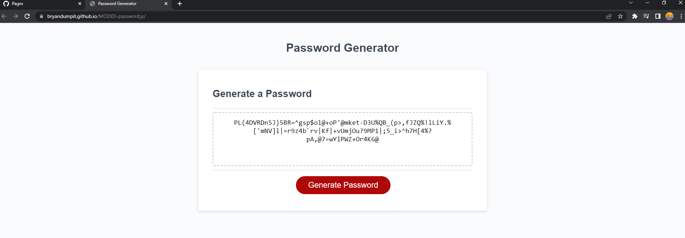

# Password Generator

## Purpose

A website that generates a random password based on parameters the users set. Parameters are password length (8 to 128 characters) and character types(i.e. should the password include lowercase, uppercase, numbers, and/or symbols).

## Built With

* HTML
* CSS
* Javascript

## Website

* https://bryandumpit.github.io/MOD03-password.js/

## Contribution

Made with ❤️ by Bryan Dumpit with help from StackOverflow (please see below for link on referenced code).

## Project Details
* javascript logic was developed to meet acceptance criteria and password generator functionality.
* pseudocode was written to identify goals for logic
* https://stackoverflow.com/questions/61021441/random-password-generator-javascript was referenced for random password generator.
    * Please note: not clear how to properly reference outside code. Link added in README.md to provide reference.
* reference code was refactored to allow for following:
    * separate functions for determining length and character type 
    * validation on password length to make sure user picks a value of 8 to 128 characters and on password character type to make sure user picks at least one of lowercase, uppercase, numbers, symbols.
* generatePassword() was defined to run passwordLength() and passwordCharType() and return the result.
